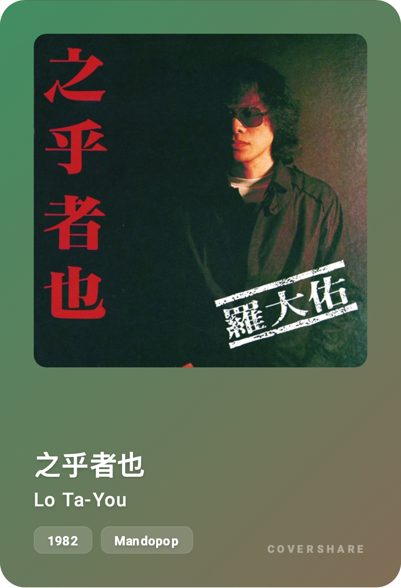

# CoverShare 🎵

#### This project is generated by Google Gemini 3.0 Pro

---

A stylish, single-page web application to generate and share beautiful music album cover cards. Search for any album, and CoverShare will create a dynamic, liquid-style card based on the album art's color palette.



## 🌐 Live Demo

I have run the project in Cloudflare Pages, and you can visit it in:
**[https://covershare.aronnax.site](https://covershare.aronnax.site)**

## ✨ Features
- **[New] Classic Vive Mode**: Provide a new mode called "Classic Vibe" which outputs the image of the album in an album case, with beautiful fonts display. Switch mode by click button in the right-top corner of the screen.
- **Album Search**: Instantly find albums using the iTunes Search API.
- **Dynamic Card Generation**: Automatically creates a visually appealing card for any album.
- **"Liquid Glass" Design**: The card background is a beautiful gradient dynamically generated from the dominant colors of the album cover. I copied the name from Apple but failed to achieve their effect.
- **Color Enhancement**: A custom algorithm boosts the extracted colors to ensure a vibrant and aesthetically pleasing theme for each card.
- **High-Quality Export**: Download the generated card as a high-resolution, transparent PNG file, perfect for sharing.
- **Modern UI**:
    -   Light & Dark mode support.
    -   Multi-language interface (English, Simplified Chinese, Traditional Chinese).
    -   Fully responsive design for both desktop and mobile.
- **Zero Dependencies**: Built with vanilla JavaScript, HTML, and CSS. No build step required.
- **[New] iOS Shortcuts Integration**: Share songs from Spotify and automatically generate cover images via iOS Shortcuts. See [iOS Setup Guide](./docs/ios-shortcut-guide.md).

## 🛠️ Technologies Used

- **Frontend**: HTML5, CSS3, Vanilla JavaScript (ES6+)
- **APIs**:
    -   [iTunes Search API](https://developer.apple.com/library/archive/documentation/AudioVideo/Conceptual/iTuneSearchAPI/index.html) for fetching album data.
- **Libraries**:
    -   [html2canvas.js](https://html2canvas.hertzen.com/): To capture the DOM element and export it as an image.
    -   [Color Thief](https://lokeshdhakar.com/projects/color-thief/): To extract the color palette from album art.
- **Fonts & Icons**:
    -   Google Fonts (Roboto)
    -   Material Icons
    -   [UnboundedSans](https://github.com/maoken-fonts/unbounded-sans)

## 🚀 How It Works

1.  **Search**: The user enters a search query (e.g., "Taylor Swift Midnights").
> Only albums or artists are allowed, because I prefer to listen to tracks within an album. You are welcome to change the search pattern.
2.  **Fetch**: The app calls the iTunes Search API to get album details, including the cover art URL.
3.  **Color Extraction**: Once the album art is loaded, the `Color Thief` library extracts a palette of dominant colors from the image.
4.  **Color Processing**: A custom `boostColor` function converts the primary RGB colors to HSL, adjusts their saturation and lightness to make them more vibrant, and ensures they work well for a background.
5.  **Render Card**: The processed colors are set as CSS custom properties (`--bg-color-1`, `--bg-color-2`) on the card element. These properties are then used in a complex `radial-gradient` to create the signature "liquid" background effect.
6.  **Download**: When the user clicks the download button:
    -   `html2canvas` is invoked to render the card element.
    -   Crucially, an `onclone` callback simplifies the CSS for the screenshotting process. It replaces the complex `radial-gradient` with a simpler `linear-gradient` and removes incompatible effects like `backdrop-filter`. This ensures a clean, high-quality render without visual artifacts.
    -   The canvas output is converted to a PNG data URL and triggered for download.

## ⚙️ Setup & Usage

As this is a self-contained project, getting started is simple:

1.  Clone this repository:
    ```sh
    git clone <repository-url>
    ```
2.  Navigate to the project directory:
    ```sh
    cd <repository-folder>
    ```
3.  Open the `index.html` file in your favorite web browser.

That's it! No installation or build process is needed.

> Or just download code zip file. But you need to download "UnboundedSans.otf" and "UnboundedSans.ttf" to get fonts support.

## 📄 License

This project is open-source and available under the MIT License.

---

*Coded with help from Google Gemini.*